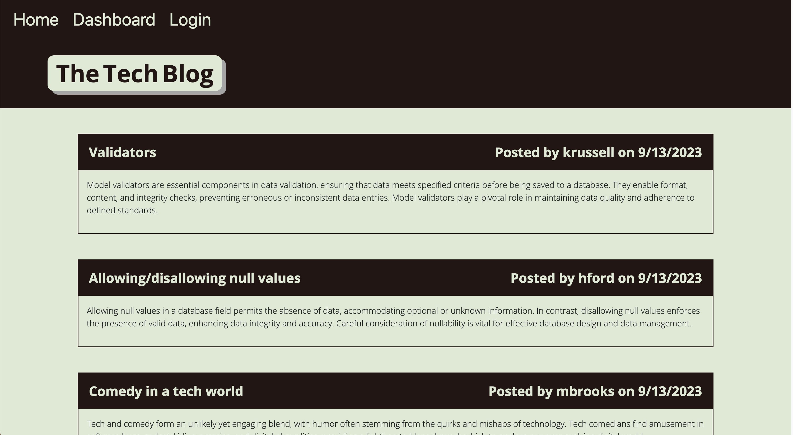

# Tech Blog

  

  ## Description
  The Tech Blog is a website which allows users to sign up, and post blog articles. It also allows users to view other posts and comment on them. As a user I want my own space to write articles about the tech topics which interest me, while allowing me to view other's posts and comment on them.
  
  ## Table of Contents
  1. [Installation](#Installation)
  2. [Usage](#usage)
  3. [License](#license)
  4. [Contribute](#contribute)
  5. [Tests](#tests)
  6. [Questions](#questions)
  
  ## Installation
  No installation necessary, just visit the website.
  
  ## Usage
  Once you have navigated to the site, you will be prompted to either signup or login. If you signup you will be automatically signed in. After logging in you will be redirected to your dashboard. The dashboard allows you to view any posts you have written, and create new ones. To edit a post, simply click on the post and change the fields you would like to change. To create a new post, click on the  new post button, enter a title and entry for the post. To comment on your or other's posts, visit the homepage and click on the post you would like to comment on. Once you are done with your session, you can log out.

  

  
  ## License
  This software is not covered under any license.
  
  ## How to Contribute
  N/A
  
  ## Tests
  N/A
  
  ## Questions
  Github: https://github.com/bklein1981
  
  Website: https://floating-ocean-15939-7f031cabb021.herokuapp.com/
  
